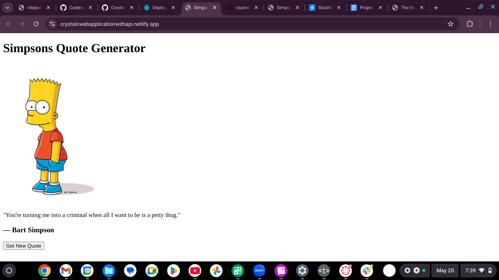

# Simpsons Quote Generator

This web application gets a random quote from "The Simpsons Quote API" and displays it using a simple and fun card UI.

## How to Run the Project 

1. Open in StackBlitz.
2. Ensure that Vite is running.
3. Click the "Get New Quote" button to load a random quote.

## API Used

- [The Simpsons Quote API](https://thesimpsonsquoteapi.glitch.me/)
- This link provides the character, quote, and image from the TV show.

## Screenshot

